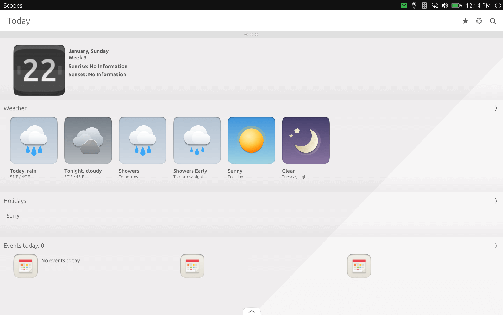
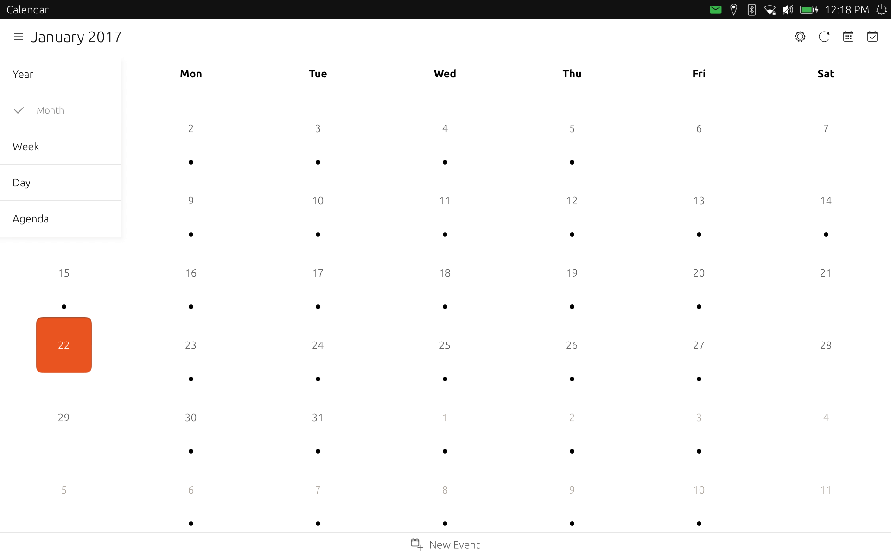

# Introduction

This course is a new project to learn how to program applications that work on Ubuntu Touch. In the process I will generate documentation with all the phases of development of an application: requirements acquisition, implementation and distribution in the Ubuntu store. One of the problems found in Ubuntu Touch is the lack of applications, both, in number and in functionality. I do not expect to change this situation in the short term, but one way to change it, is by programming applications and helping other users do the same. Only in this way it will (it) be possible to change this situation.

This course is not a master class in which I explain something and others repeat them automatically. The idea, is to publish chapters and complete the course documentation with the feedback of the other users. If a particular block gets more interest, it can be extend later. There is no problem in asking questions in the resources associated with the course.

The documentation will be structured as a book. Its access is free and any user can read it in the browser or as PDF, ePub or Mobi files. It is possible to add comments to the book, although it is necessary to have an account created in Gitbook. The source code for the examples and applications will be hosted on Launchpad using Bazaar as version control. On the same page there is a mailing list in which you can ask questions. Additional to the resources mentioned earlier, there is also a Trello board with the course status.

Finally I want to thank the users who have encouraged me to start this madness, among them are kain_X_X and LarreaMikel. A course of this type can not be done by a single user. Evolving and achieving larger goals is only possible when many people contribute to.

# Previous Knowledge
Due to the subject of the course itself, some programming skills are requested. In this course we will mainly use QML for the user interface and JavaScript or C/C++ for the logic. It helps to know either of the two languages, ​​although it will not be critical. Each chapter will explain the basic elements and a bibliography will be included for the user to consult if in doubt.

The Ubuntu Touch Software Development Kit (SDK) is being released for the Ubuntu distribution. It will therefore be necessary to use Ubuntu or any of the distributions that take it as a base. Not meeting this requirement is not a serious problem either, because you can do the same in a virtual machine or using a Live USB.

To make it easier to follow the course, I will only put the most important parts of the source code. The rest of the files will be in a source repository in Launchpad. It would be helpful knowing the basic commands of Bazaar.

# Objectives of the Course

The main objective of the course is to learn how to program applications for Ubuntu Touch while having fun. Programming is a time-consuming task and you have to like what you are doing. Applications can be simple or complex, the important thing is that they solve a need that we have. For example, an application that has a list of plants in the garden and let us know when we have to water them.

A good design in the logic of the application can greatly reduce development time. In the same way a bad design can cause to end up throwing the code to the recycle bin and starting over, because it is easier to start with a different approach.

# Types of Applications
Ubuntu Touch has three types of applications. We can find Web Applications (WebApps), Scopes and Native Applications. A web application is basically a web browser tab that runs independently. It has its own icon in Unity (the application launcher) and can contain remote information of any type. For security reasons a Web application does not have access to the local content of the terminal.

The scope is the second type of application found in Ubuntu Touch. To some extent it behaves like a screen that shows information to the user. The information can be external, for example the weather forecast, or internal in the form of information aggregator. An example of this case would be the "Today" scope. This scope shows information from different applications.

Finally we have native applications. In this case the applications can access all the resources of the phone and are, eventually, more complex than the Web applications and the scopes. Applications are confined in Ubuntu Touch and can only access their own information. If we want to access information from other applications, we need to pass it through the content-hub. As an example of native application we have the calendar.

# Evolution of the Course
One detail that I want to point out (and that you will get tired of reading it throughout the course) is that this course is not a master class. It is important that you participate with either questions, suggestions or errors. The order of the chapters can vary and chapters that were already closed can be opened to add new content. This course is alive and can only be improved if we all get involved. It doesn’t matter if questions are very basic or what the other users would say. The main reason of following this course is learning. Remember: The only stupid questions is the one that you don’t ask.

Access to the mailing list is open and only a Launchpad account is needed. There is no censorship except several cases of common sense:
* The questions must be related to the course.
* Spam of any kind is not allowed.
* Attacking other users is not allowed.

If any of these rules is broken, I will warn the person first. If the user continues with its attitude, will be asked to leave the mailing list. I hope I never have to get to that end.

This course is not set as a whole and therefore I will write it week after week. For this reason, it is possible that some error appears. If this is the case, do not hesitate to warn me in order to correct it. This course is an opportunity to create content and give a boost to Ubuntu Touch.

# Resources
* Mailing List: https://launchpad.net/~ubuntu-touch-programming-course
* Trello Board: https://trello.com/b/gQEXHP3v/ubuntu-touch-programming-course

# People who have collaborated
* Larrea Mikel: revision of the chapter in Spanish.
* Cesar Herrera: revision of the English translation.
* Joan CiberSheep: revision of the English translation.
