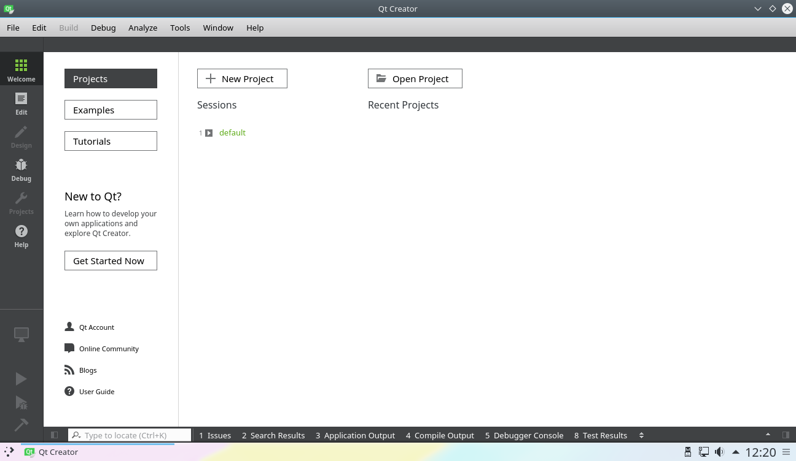

# Introduction

One of the most important changes in this block is the work philosophy. The calculator has been programmed from scratch using QML, JavaScript and the Ubuntu Touch SDK. The Ubuntu Touch IDE uses Qt Creator as the basis and modifies it so that native Ubuntu Touch applications can be programmed. This SDK can also be used to program desktop applications. It may seem reasonable to continue using it to make portability to a mobile device easier.

The reasoning is valid but has one small problem: **the SDK is a dead project. You will not receive updates that fix bugs, nor can you take advantage of new features that include the latest versions of Qt**. When working with desktop tools these problems disappear. The downside is that migration of code to the SDK can be more costly. 

The first objective is to develop a useful application that is relatively complex. In order to have users on a platform you need applications that meet their needs. The second objective is to be able to program using robust tools. Qt Creator is very user-friendly and can be installed on different operating systems without having to rely on a virtual machine. Finally, I am also interested in increasing the number of users following the course.

## The task manager

The application I have chosen for this block is a task manager. The user writes down day-to-day tasks and then sees them in different ways. Initially it will work locally but later can be synchronized with network drives or Web applications. The same application should work in UBports and on the desktop.

I'm going to take as a base the excellent [task manager Todoist](https://todoist.com). It is a **multiplatform tool that has an open API** and the premium account has a reduced cost. The task manager will initially synchronize with Todoist but I don't rule out other platforms. Tasks will be entered on the desktop / UBports and information will be accessible in the web browser or on an Android device without having to do any extra work.

## The development environment

As I mentioned before, **the Ubuntu Touch IDE and Qt Creator share a common base**. Qt Creator can be installed from Ubuntu repositories but conflicts with the SDK version. For this reason I have decided to create a new virtual machine that only has the elements necessary to use Qt Creator installed.

The chosen distribution is KDE Neon (I wanted to try it) and in the following images you can see some screenshots. I would like to remind you that Qt Creator is available in virtually all GNU/Linux distributions and you can use the one that interests you most. KDE Neon uses Ubuntu 16.04 as the base, so you can also use PPA repositories.

The installation of KDE Neon is simple and I will not go into details of the process. As a curiosity, the installation includes a notebook model from [the Spanish company Slimbook](https://slimbook.es/).

When the installation is finished you must restart the computer and you can start working. The desktop's initial screen is pretty clean. 

In the next chapter I will explain how to install the Qt programming tools. The working philosophy will be similar to the one seen until now: a project is created, development kits are chosen and programming begins. There are many kits available, including one that allows you to **program Qt apps for Android**.

# Documentation

For this block I will use the [Qt documentation](https://doc.qt.io/) and [UBports documentation](https://api-docs.ubports.com/). I will also follow two books from those listed in [Qt's list](https://wiki.qt.io/Books).

- [Qt 5 Cadaques (free in English).](http://qmlbook.github.io/)
- [Mastering Qt 5 (English).](https://www.packtpub.com/application-development/mastering-qt-5)