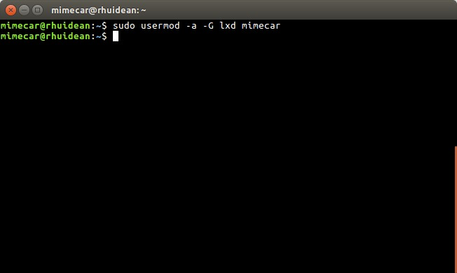
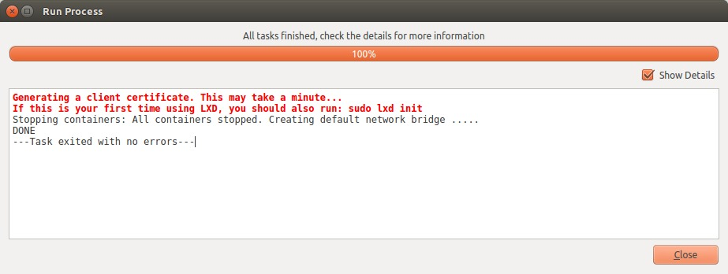
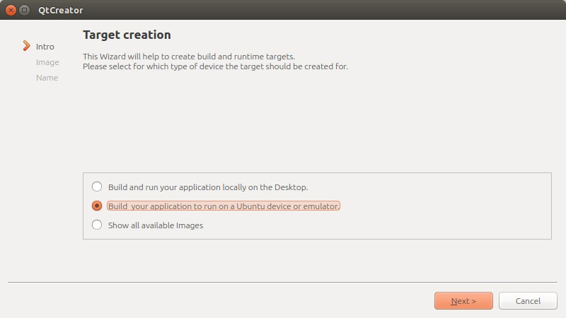
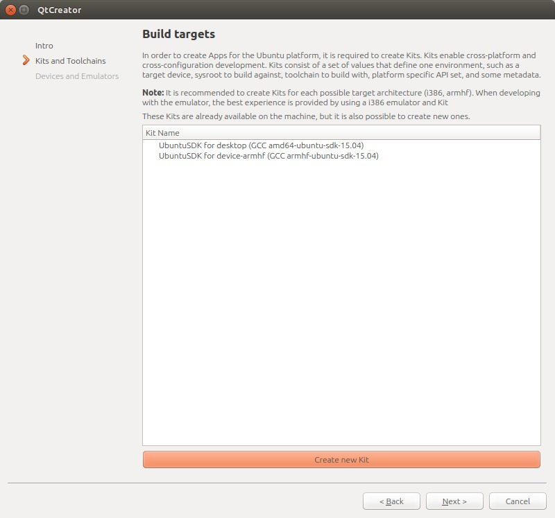
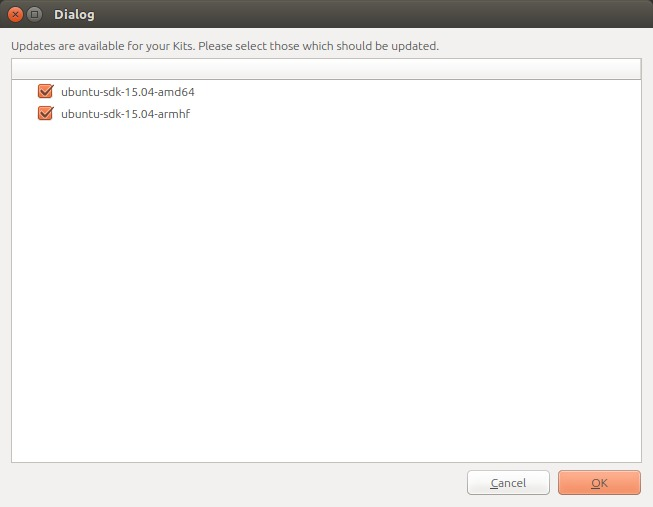
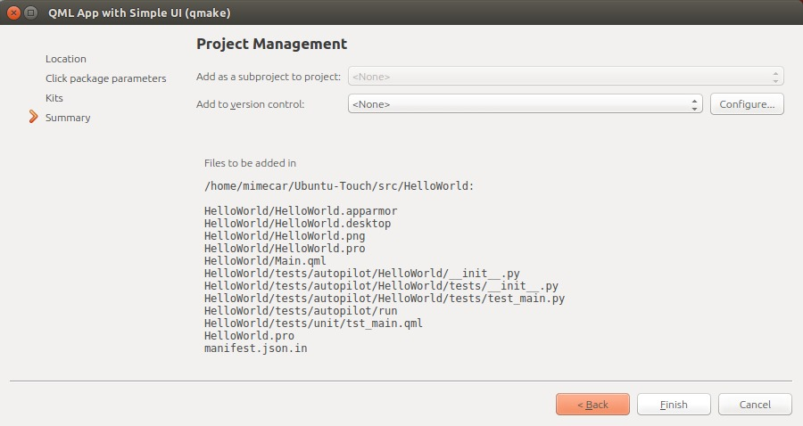
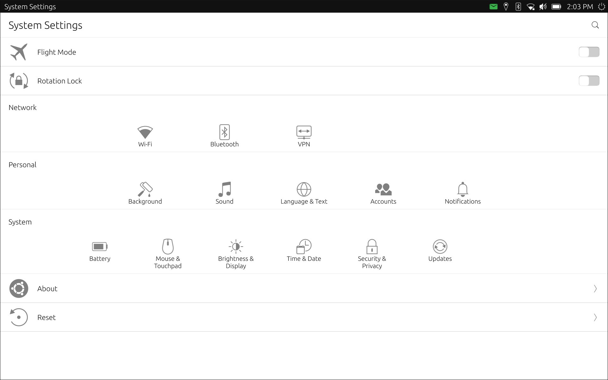

# chapter-02-sdk

## Introducción

En el capítulo anterior se ha visto una introducción al curso de programación con Ubuntu Touch. El siguiente paso es preparar el entorno de trabajo. Cuando se programa en cualquier lenguaje se utiliza un SDK \(Software Development Kit\). El SDK es básicamente un conjunto de herramientas que procesan el código fuente y genera el ejecutable para la plataforma que se esté usando. Ubuntu Touch no es una excepción y tiene también un SDK propio.

En GNU/Linux las aplicaciones se encuentran en repositorios. El repositorio contiene un conjunto de aplicaciones que se pueden instalar de forma sencilla. En algunas ocasiones hay aplicaciones que no están en los repositorios oficiales. Para estos casos, es posible usar un repositorio personal, también conocido como PPA. El SDK de Ubuntu está en un repositorio PPA que se tiene que añadir previamente al sistema. Debido a esta limitación, el SDK sólo se puede usar en distribuciones que soportan repositorios PPA, es decir, que tengan Ubuntu como base. Si la distribución usa paquetes RPM como es el caso de OpenSuse o Fedora habrá que tomar medidas alternativas.

Las medidas alternativas son dos: crear un Live USB con Ubuntu y ejecutar el sistema operativo desde el USB o utilizar una máquina virtual que tenga Ubuntu instalado. La primera medida es más sencilla y funciona razonablemente bien si la memoria USB es rápida. La segunda medida es más cómoda ya que no depende de una memoria USB pero requiere de un ordenador más potente para mover el sistema operativo virtualizado.Si alguno está en uno de estos dos casos puede preguntar en la lista de correo y le guiaré con los pasos más importantes.

Mi entorno de desarrollo es:

* Ubuntu 16.04 LTS.
* Aquaris E4.5 con la OTA-14.
* Aquaris E5 HD con la OTA-14.
* Aquaris M10 FHD con la OTA-14.

Es posible que en otras distribuciones haya algún paso intermedio que sea necesario realizar para configurar el SDK. Si ese fuera el caso podéis indicarlo para añadirlo.

## Instalación del SDK de Ubuntu

La instalación del SDK es muy sencilla y no debería demorarse más de un par de minutos. Es recomendable tener el sistema actualizado antes de empezar. Para el caso de Ubuntu se puede hacer con los comandos:

```bash
sudo apt-get update && sudo apt-get upgrade && sudo apt-get dist-upgrade
```

Utilizo sudo porque la instalación de paquetes requiere de permisos de administrador. El primer comando actualiza el listado de repositorios. Si no hay ningún error se ejecuta el segundo comando, que se encarga de actualizar las aplicaciones. Por último el tercer comando actualiza algunos paquetes del sistema operativo que de normal no se actualizan.

Se añade el repositorio del SDK de Ubuntu Touch con el comando:

```bash
sudo add-apt-repository ppa:ubuntu-sdk-team/ppa
```


Aparecerá en pantalla la información del repositorio. Se puede continuar pulsando la tecla INTRO.


Todos los repositorios tienen una firma que nos asegura que los paquetes instalados provienen del repositorio. Esa firma se añade al sistema y se utilizará cuando se instalen paquetes del repositorio.


Después de añadir un repositorio hay que actualizar la información de los paquetes que contiene. Se puede hacer con el comando:

```bash
sudo apt-get update
```

Ya está todo preparado . El último paso de este apartado es instalar el SDK de Ubuntu Touch.

```bash
sudo apt-get install ubuntu-sdk
```


Aunque en el comando se instala sólo un paquete \(ubuntu-sdk\) realmente se están instalando de forma automática todas las dependencias que tiene ese paquete de forma que funcione sin problemas. La instalación puede durar un rato dependiendo de la conexión a Internet. Es un buen momento de dejar trabajar al ordenador y tomarse un buen café.

## Configuración del entorno

El SDK de Ubuntu Touch incluye las herramientas que permiten generar las aplicaciones y un editor \(IDE\) para que sea más sencillo programar. Las herramientas toman el código fuente de la aplicación y lo procesan. Si el destino es el ordenador no hay ningún problema. En cambio, si el destino es un dispositivo que usa Ubuntu Touch la cosa cambia un poco. Estos dispositivos usan la arquitectura ARM, que es diferente de la que usa el PC. Para generar el ejecutable se utiliza un compilador cruzado que se ejecuta en un contenedor \(LXD en las últimas versiones del SDK\).

Para trabajar con LXD hay que añadir al usuario que se usa en el ordenador al grupo lxd

```bash
sudo usermod -a -G lxd usuario
```



Después de ejecutar el comando hay que cerrar la sesión del usuario y abrirla de nuevo. Con esta pequeña modificación ya se puede empezar a trabajar. La aplicación que se tiene que ejecutar es ubuntu-sdk-ide y se puede lanzar desde el menú de inicio del escritorio o pulsando ALT+F2 y escribiendo el nombre. La primera vez aparecerá una pantalla en la que se tiene que configurar LXD. Sólo hay que pulsar 'Yes' para que se genere la configuración por defecto.




Si el usuario no está en grupo lxd puede salir la siguiente pantalla de error. En ese caso es suficiente con cerrar sesión y entrar de nuevo. Al lanzar el IDE de Ubuntu Touch no debería dar ningún error.


## Asistente de configuración

La primera pantalla del asistente es una introducción a QtCreator. Para continuar hay que pulsar en el botón Next \(siguiente\).


Aunque el curso está enfocado a dispositivos móviles como teléfonos o tabletas, también se pueden aplicar los conocimientos a las aplicaciones de escritorio. Cada uno de estos dispositivo tiene asociado un kit, un conjunto de herramientas, que toman como base el código que se programa y genera los archivos necesarios para cada dispositivo.


Pulsa en el botón 'Create new Kit'. Hay que seleccionar la primera opción.


En el listado aparecen varios kits para descargar. Ubuntu Touch está basada en estos momentos en Vivid por lo que hay que seleccionar esa opción.


Por último se rellena el nombre que tendrá el kit.


Al completar el último paso se vuelve a la pantalla inicial de los kits. Hay que pulsar de nuevo el botón 'Create new Kit' y repetir el proceso seleccionando Ubuntu Device \(dispositivo Ubuntu\).



Con este kit aparecen más opciones para elegir. Los teléfonos o tabletas que usan Ubuntu Touch trabajan con la arquitectura armhf. En el listado hay que seleccionar un kit que tenga esa arquitectura. La versión de Ubuntu Touch es Vivid, igual que en el caso anterior. Por último hay que elegir 686 o x64 dependiendo de si el ordenador utiliza 32 o 64 bits.


Después de pulsar en el botón Next se escribe el nombre asociado al Kit.


De momento no es necesario crear Kits adicionales.



En el último paso del asistente se pueden configurar los dispositivos físicos y el emulador. Hay algunos problemas con el emulador. De momento os recomiendo no configurar el emulador. Se pueden probar las aplicaciones de forma nativa en el ordenador. Por esta razón hay que desmarcar la casilla 'Create emulator' y pulsar en el botón Finish \(finalizar\).


## Hola mundo

Para no perder las buenas tradiciones el primer paso es programar una aplicación mínima que nos permita comprobar el correcto funcionamiento del SDK. La aplicación se ejecutará en el ordenador de forma nativa y en una tableta. Si aparece la siguiente pantalla hay que instalar todas las actualizaciones.



### Creación del proyecto

Pulsad en el menú File \(Archivo\), New file or project \(Nuevo archivo o proyecto\). Aparecerá una ventana con los tipos de proyectos que se pueden usar. El interfaz de usuario se realiza con QML que es un lenguaje de scripting orientado a la creación de interfaces gráficos. La lógica de la aplicación se puede hacer con varios lenguajes. De momento se usará JavaScript. Hay que seleccionar la primera opción y después pulsar en el botón Choose... \(Elegir\).


Se debe elegir la carpeta en la que se guardarán los proyectos. El nombre del proyecto no puede contener espacios.


Las aplicaciones necesitan una información básica: usuario y mantenedor. El resto de parámetros se deben quedar como vienen por defecto. Es importante respetar la estructura en el campo Maintainer \(mantenedor\) para que nos deje continuar.


Hay que seleccionar los kits que se quiere usar. Por defecto se seleccionarán los dos para poder ejecutar la aplicación en el ordenador y en el dispositivo móvil.


La última pantalla contiene un resumen de los pasos del asistente. Pulsamos en el botón Finish \(Finalizar\).



Se abrirá de forma automática el proyecto.


### Ejecución de la aplicación en el ordenador

Para ejecutar la aplicación hay que pulsar el botón Play que está en la parte inferior izquierda de Qt Creator.


### Ejecución de la aplicación en un dispositivo real

Antes de ejecutar la aplicación es necesario configurar el dispositivo. Para las pruebas he partido de una tableta Aquaris M10 FHD con la OTA-14 aunque el procedimiento es el mismo en los otros terminales. Hay que dejar abierto ubuntu-sdk-ide y conectar el dispositivo por USB al ordenador. Para activar las opciones de desarrollo hay que acceder a la configuración del sistema.



Pulsad Acerca de este dispositivo \(About en la captura\).


Seleccionad Modo de desarrollador \(Developer Mode en la captura\). Este modo está por defecto desactivado ya que permite controlar el dispositivo de forma remota si está conectado por USB al ordenador. Marcar la casilla.


A los pocos segundos debe aparecer una notificación con la petición de conexión del ordenador.


Ya han finalizado todos los pasos en el lado de la tableta. En el IDE hay que seleccionar como destino de la compilación la tableta. Para hacerlo hay que pulsar en el botón que hay encima del Play y seleccionar como destino el dispositivo que acabamos de configurar.

A los pocos segundos de pulsar el botón Play aparecerá la aplicación en el dispositivo. 

Puede aparecer el siguiente error al lanzar la aplicación. 

En la barra lateral de Qt Creator hay que pulsar en el botón 'Devices'. Al seleccionar el dispositivo aparecerá una pantalla con diferentes opciones. En el apartado Kits hay que pulsar el botón Remove y después el botón Create \(que aparece al eliminar el kit\). 

Ahora hay que asociar el kit nuevo con el proyecto. En la barra lateral hay que pulsar en 'Projects', 'Add kit' y seleccionar el kit que aparece en el botón desplegable.


Espera un par de segundos y selecciona el dispositivo como destino de la compilación. Es importante que se pruebe la compilación en los dos casos. En el siguiente capítulo empezaré con el código fuente y asumiré que todo funciona correctamente. Si tienes cualquier problema puedes preguntar en la lista de correo.

## Colaboradores

* Larrea Mikel: revisión de los capítulos.

