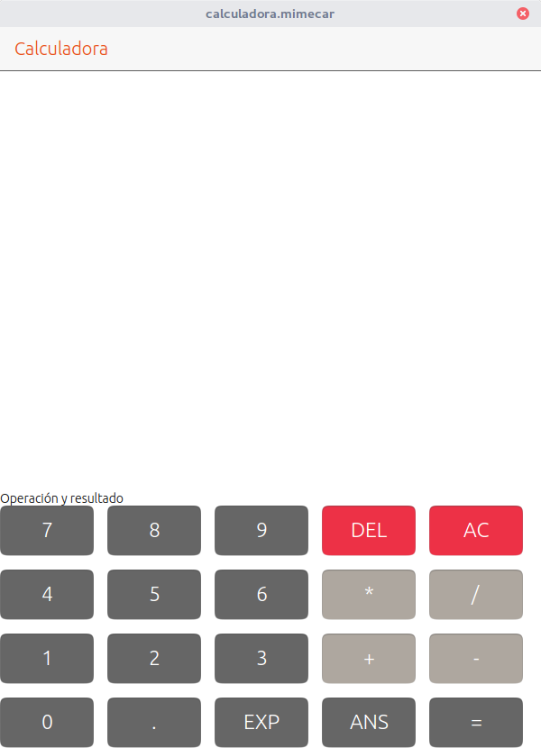
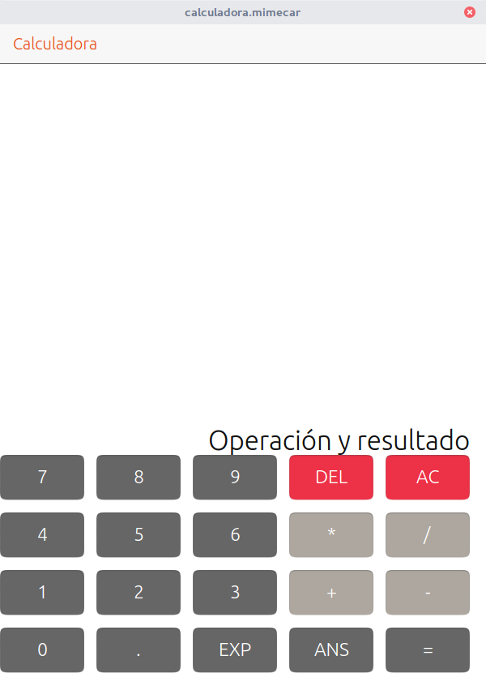
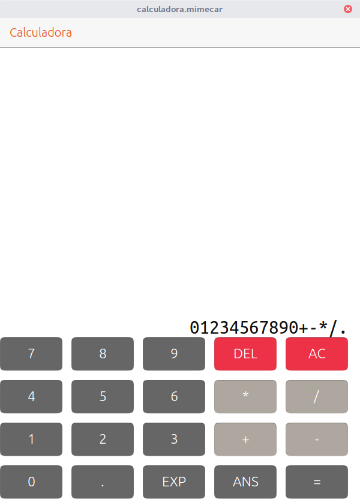

# Formateo de etiquetas y eventos

Tomando como base el código anterior, la calculadora con botones, se añadirá en esta entrega más información en forma de etiquetas. Una etiqueta es un componente que muestra información al usuario. Se puede usar tanto para mostrar información fija como variable. El primer caso ya se estudió al principio del curso mientras que en esta entrega se verá el segundo caso. Cuando el usuario pulsa en los botones de la calculadora tiene que recibir realimentación de que ha hecho algo. Los botones cambian la apariencia de forma automática pero no tiene información de las operaciones que ha introducido. Ese problema se arreglará usando una etiqueta que muestre los valores de la operación.

Aparte de mostrar el texto en la etiqueta es necesario guardar los números y la operación en algún sitio. Para hacerlo se usarán un par de variables auxiliares. El flujo de la aplicación sería:

* El usuario introduce el primer número.
* Se selecciona la operación.
* El usuario introduce el segundo número.
* Se selecciona el botón ANS.

Lo más sencillo sería concatenar el texto del botón a la etiqueta para mostrar la operación al usuario. El problema con esa aproximación es que después habría que extraer esa información de la etiqueta para hacer las operaciones por código. Esa solución tiene más inconvenientes que ventajas. Otra forma de plantearlo es siguiendo el camino opuesto: los botones actualizan unas variables y después se encargan de actualizar la etiqueta. De esa forma la etiqueta sólo mostraría la información que tenemos a nivel interno (modelo) y sería más manejable. Para implementar esta función se introducirá también el uso de métodos (funciones) en QML.

Se tomará como origen la aplicación de calculadora del apartado anterior y que se muestra en la siguiente imagen.


# Etiqueta para mostrar las operaciones

En una primera iteración se colocará la etiqueta anclada a la parte superior del grid de botones. El hueco que queda en la parte superior se usará más adelante para mostrar un histórico de las operaciones con otro componente para trabajar con texto. El primer paso será por tanto crear el componente con un texto por defecto. La cuestión es, ¿por dónde empezamos? Por los comentarios que habéis hecho relacionados con el ejercicio del grid hay dudas con el funcionamiento del anchor. A partir de ahora se usarán bastante los anchors por lo que conviene recordar su funcionamiento para seguir la lección.

Los componentes en QML se tienen que ver como cajas. Cada caja tiene cuatro anchors (anclas) en las posiciones arriba, abajo, izquierda y derecha. Jugando con los anchors es posible distribuir los componentes por la pantalla de forma arbitraria. Hay dos formas de distribuir los componentes:

* Definiendo las relaciones entre ellos usando anchors.
* Usando un layout.

En la calculadora ya se han usado las dos formas en lo que llevamos de curso. Los botones están distribuidos usando un layout Grid. El grid también se comporta como un componente en QML por lo que es, a efectos de diseño, una caja con cuatro anchors. Los componentes están colocados dentro de una Page (página) que también es una caja con anchors...

Para mover el grid de botones hay que relacionar los anchors de la página y del grid. Dependiendo como sea esta relación se organizarán en la pantalla. Lo más sencillo es asignar la posición del grid bottom con la misma posición de la página:

```js
anchors.bottom: page.bottom
```

La duda que puede aparecer en este punto es, ¿dónde está definido "page"? El componente que está en el código es Page y en QML se diferencian las mayúsculas de las minúsuculas. Cuando se crea un componente se definen varios atributos. Entre esos atributos está un identificador que permite acceder al componente desde otras partes del programa. El identificador no es obligatorio para mostrar el componente pero si lo es si se quiere usar más adelante. La definición de Page quedaría de esta forma:

```js
Page {
  id:page

  ...

}
```

Ahora cualquier componente podría acceder a la información de Page. El identificador se puede usar tanto en los componentes como en los layouts. Si se añade un identificador al grid se podrá anclar la etiqueta al componente. De esta forma si el grid crece al añadir nuevos, la etiqueta se adaptará a la nueva posición sin hacer nada.

Creamos la etiqueta y le asignamos un ID:

```js
Label {
  anchors.bottom: grid.top
  text: "Operación y resultado"
}

Grid {
  id: grid

  ...
}
```



La etiqueta está posicionada en la parte superior del grid. El texto queda un poco extraño en la parte izquierda de la pantalla. Siguiendo con el símil de la caja, la etiqueta es una caja que empieza en la primera "O" y acaba en la última "o". Para alinearlo a la derecha es necesario añadir un anchor nuevo que sea el mismo para la etiqueta y el grid.

```js
anchors.right: grid.right
```


Un detalle importante que no se aprecia mucho por el fondo de la pantalla es que ni el grid ni la etiqueta están alineados con la parte derecha de la pantalla. Queda un hueco sin usar. Es posible asignar la etiqueta al anchor de la página en lugar de usar el del grid pero en ese caso quedarían descuadrados los botones y las etiquetas. Se verá una solución a este problema más adelante.

Antes de continuar con la aplicación es necesario arreglar un poco la apariencia de la etiqueta. El texto tiene que ser más grande y la fuente se cambiará por una fuente que sea monoespaciada, es decir, que todos los caracteres tengan el mismo ancho. Ambas modificaciones se aplican en el Label que se ha creado antes.

Para cambiar el tamaño de la fuente se sigue la misma lógica que se siguió en los botones usando el atributo font.pointsize. El resultado tiene que ser similar al mostrado a continuación:



En mi caso el tamaño de la fuente es 25. No pongo el código porque ya tenéis un ejemplo en los botones y quiero que os peléis con la aplicación. Las dudas de la entrega anterior aparecían justamente en las partes de código que no aparecían en la explicación. Puedo resolver las dudas pero es importante que busquéis por vuestra cuenta la forma de resolver los problemas.

Para cambiar la familia de la fuente se utiliza el atributo font.family. Dentro de la etiqueta hay que añadir:

```js
font.family: "UbuntuMono"
```

Con las letras es más complicado ver la fuente monoespaciada. Por esa razón he sustituido el texto inicial por los números y operaciones de la calculadora.



El mismo código pero con la fuente que viene por defecto. En los números no se nota tanto el cambio de fuente pero si se nota en las operaciones. Fijaros en la posición del cero respecto al botón "AC" en las dos capturas.


Después de esta pequeña introducción a la etiqueta es el momento de pasar a la parte divertida. El código de este bloque hasta este punto está en el ejercicio 07.

# Añadir lógica a los botones
El objetivo es que los botones que pulse el usuario aparezcan como texto de la etiqueta. Si el usuario pulsa el número 7 aparecerá ese texto. Cuando pulse otro se concatenará el texto que había en la etiqueta con el texto que tenga el nuevo botón.

Cuando se usan los componentes en QML se generan de forma automática varias señales, por ejemplo, botón pulsado o botón soltado. Esas señales se pueden procesar en el código y hacer cosas cuando se detecten. Como ejemplo se procesará la señal **onClicked**.

El código del botón 7 quedaría de esta forma:
```js
Button {
  text: "7"

  font.pointSize: 17
  color: UbuntuColors.graphite

  width: buttonWidth
  height: buttonHeight

  onClicked: {
    resultado.text = resultado.text + "7"
  }

}
```

Para acceder a la etiqueta hay que crearle primero un identificador (id) con el nombre "resultado". Al pulsar el botón se genera la señal onClicked. Como se está capturando esa señal se ejecuta el código que hay entre llaves. Básicamente hace que el atributo text concatene el valor que tenía con el valor del número.

El ejercicio que dejo como ejercicio final de esta entrega es añadir la lógica a todos los botones de la calculadora. Los botones con las operaciones pueden mostrar en la etiqueta el mismo texto que tiene el botón. Al final la aplicación tiene que mostrar en la etiqueta los botones que se pulsan.

Esta entrega es un poco más corta que las anteriores. Aparte de ver el funcionamiento de los componentes QML estoy introduciendo lógica a la aplicación. Esa lógica permite que la aplicación haga determinadas cosas cuando el usuario la usa. En el curso parto de cero con los conocimientos del usuario tanto al programar con QML como al programar. Por esa razón voy introduciendo conceptos poco a poco para que sea más sencillo de seguir. Si tenéis cualquier duda podéis usar los medios asociados al curso, no tengo problema en resolver dudas más avanzadas a lo que se está explicando en el curso.
